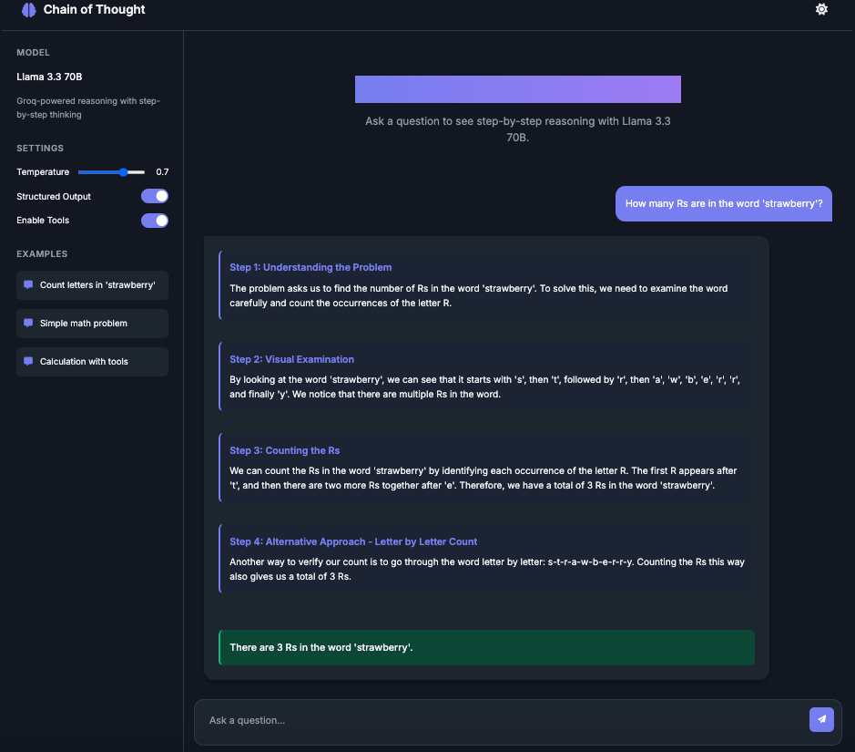

# Chain of Thought: Llama 3.3 70B Reasoning Framework



Implements a Chain of Thought (CoT) reasoning framework using Meta's Llama 3.3 70B model via the Groq API. The system enables step-by-step reasoning for complex problems, making AI thinking transparent and interpretable. By breaking down reasoning into explicit steps, the model produces more accurate, verifiable, and trustworthy results.

## Features

- **Step-by-Step Reasoning**: Prompts the model to break down complex problems into sequential, logical steps
- **Transparent AI Thinking**: Makes the reasoning process visible and interpretable
- **Configurable Parameters**: Adjustable temperature settings (default: 0.7) to balance creativity and precision
- **Structured Output**: Toggle between structured JSON output and free-form text
- **Tool Integration**: Optional integration with external tools for enhanced reasoning capabilities
- **Modern UI**: Clean, responsive dark-themed interface for an optimal user experience

## Technical Implementation

### Backend

- **Model**: Llama 3.3 70B (December 2023 knowledge cutoff)
- **API Integration**: Groq API for high-performance inference
- **Framework**: FastAPI for robust API endpoints
- **Reasoning Architecture**: Custom prompt engineering for inducing multi-step reasoning
- **Error Handling**: Graceful fallback mechanisms when structured output fails

### Frontend

- **Responsive Design**: Works across desktop and mobile devices
- **Real-time Interaction**: Immediate feedback as users submit queries
- **Syntax Highlighting**: Proper formatting for code and mathematical expressions

## Getting Started

### Prerequisites

- Python 3.8+
- Groq API key

### Installation

1. Clone the repository:
   ```bash
   git clone https://github.com/yourusername/chain-of-thought-llama.git
   cd chain-of-thought-llama
2. Create a virtual environment and install dependencies:
   ```bash
   python -m venv venv
   source venv/bin/activate  # On Windows: venv\Scripts\activate  
   pip install -r requirements.txt
3. Create a .env file with your Groq API key:
   ```bash
   GROQ_API_KEY=your_api_key_here

### Running the Application

1. Start the server:
   ```bash
   python examples/web_app.py
2. Open your browser and navigate to:
   ```bash
   http://localhost:8000

## How It Works

The system uses a specialized prompt template that instructs Llama 3.3 70B to:

1. Break down problems into multiple reasoning steps
2. Provide a title for each step
3. Show detailed work for each step
4. Determine when to proceed to the next step or provide a final answer

### Example prompt structure:
   ```text
   You are an expert AI assistant that explains your reasoning step by step.
   For each step, provide a title that describes what you're doing in that step, along with the content.
   Decide if you need another step or if you're ready to give the final answer.
   ``` 
The response is structured as a JSON object containing an array of reasoning steps and a final answer, which is then rendered in the UI.

## Use Cases

- Educational Tools: Explain complex concepts step-by-step

- Problem Solving: Break down mathematical, logical, or analytical problems

- Decision Support: Provide transparent reasoning for recommendations

- Code Generation: Explain programming logic before generating code

## Limitations

- Limited to Llama 3.3 70B's knowledge cutoff (December 2023)

- Text-only interactions (no image or audio processing)

- Requires internet connection for API access

- May occasionally produce reasoning errors on highly complex problems

## Future Improvements

- Integration with additional models for comparison

- Enhanced tool usage for more complex calculations

- Local model deployment options

- Collaborative reasoning capabilities

- Evaluation metrics for reasoning quality

  ## Acknowledgement

- Meta AI for creating the Llama 3.3 70B model

- Groq for providing the high-performance inference API

- The open-source community for inspiration and tools


